# 🔧 Creación de Workflow en IWHI


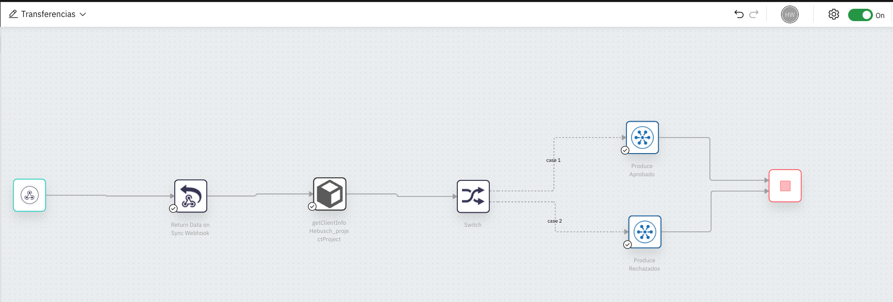

---

## Paso 1 — Crear el Workflow

Ve a la sección **Integrations → Workflows** dentro de tu proyecto en IBM webMethods Integration. Si aún no tienes ningún workflow, verás la pantalla vacía con el botón `+`.

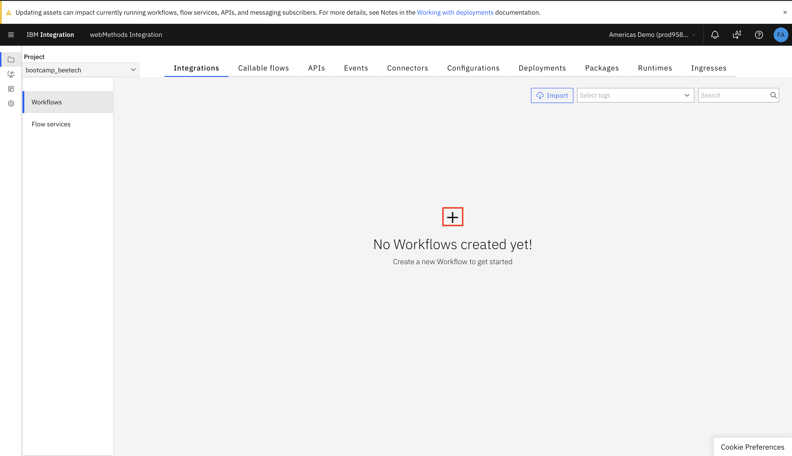

Haz clic en el botón `+` para iniciar la creación. Aparecerá el modal **"Start Building your Workflow"**. Selecciona **Create New Workflow** para construirlo desde cero.

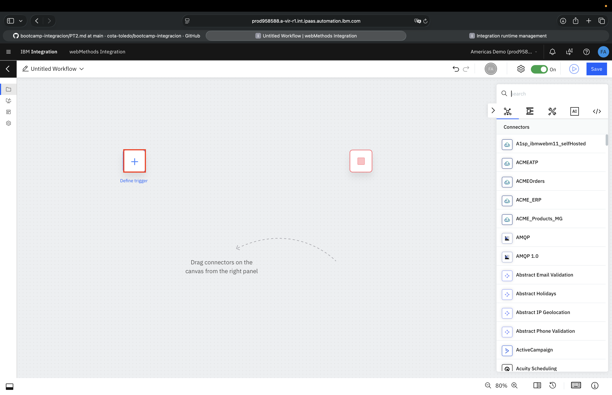

Se abrirá el **canvas** del workflow con el panel de conectores a la derecha. El flujo parte de un bloque vacío **Define trigger** que configuraremos a continuación.


---

## Paso 1.1 — Crear el Webhook (Trigger)

El primer bloque del workflow es un **Webhook** que actúa como trigger: el flujo se gatilla cada vez que un cliente realiza una transferencia.

Haz clic en **Define trigger** y, en el modal que aparece, busca `web` para filtrar los triggers disponibles. Selecciona **Webhook**.

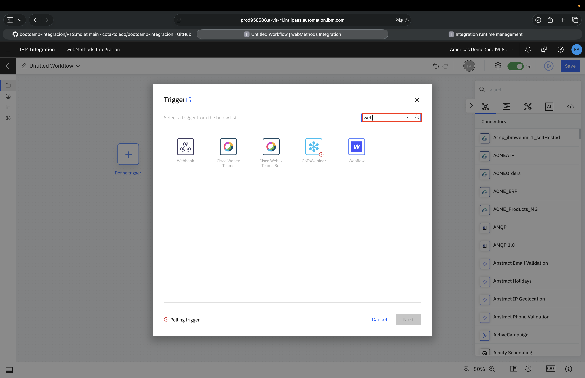

### Configuración del payload

IWHI generará una URL de prueba. Cópiala haciendo clic en el ícono de copiar y envíale el body de ejemplo usando Postman o `curl`:

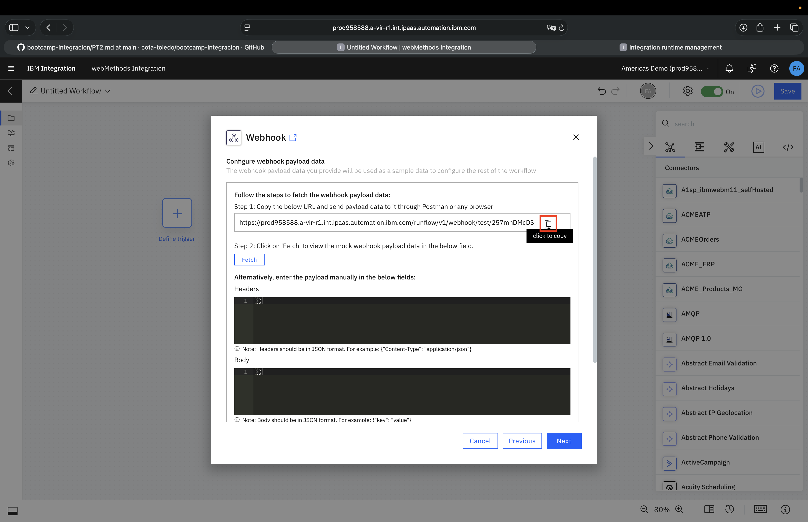

El body que debe recibir el webhook tiene la siguiente estructura:

```json
{
  "numero_cuenta": "ES0100010001001234567890",
  "monto": 1000,
  "trx_id": 1234
}
```

| Campo | Tipo | Descripción |
|---|---|---|
| `numero_cuenta` | `string` | Número de cuenta del cliente que realiza la transferencia |
| `monto` | `number` | Monto de la transferencia |
| `trx_id` | `number` | Identificador único de la transacción |

Una vez enviado el request de prueba, haz clic en **Fetch** para que IWHI capture el payload recibido. Verás el body completado automáticamente con los valores enviados.

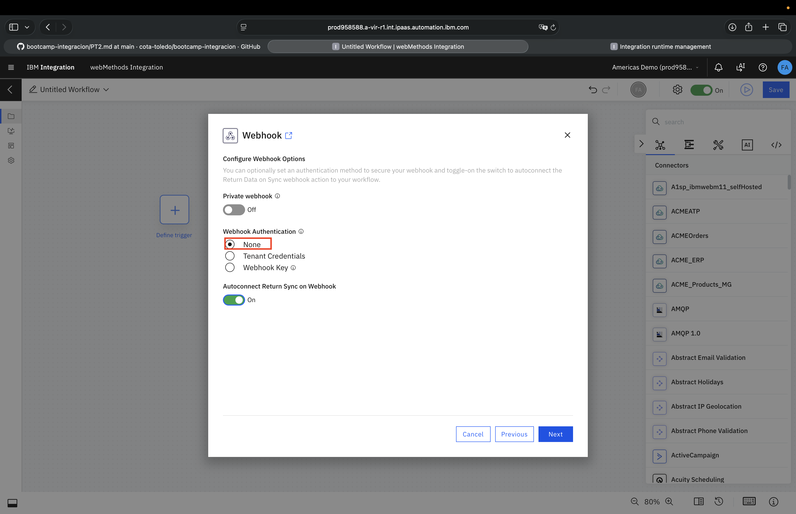

Confirma que el body quedó cargado correctamente con los tres campos (`numero_cuenta`, `monto`, `trx_id`) y haz clic en **Next**.

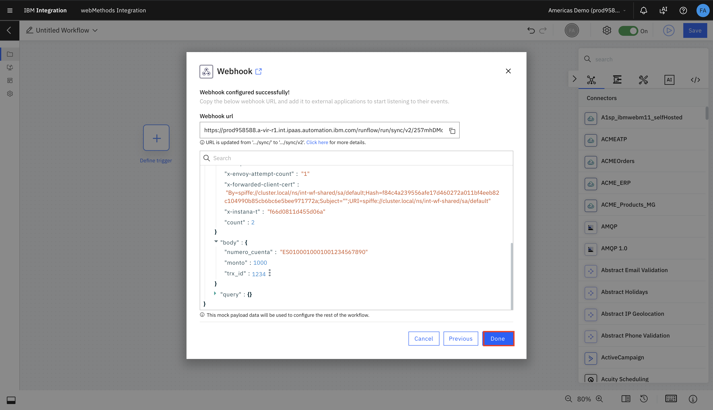

### Opciones del Webhook

En la pantalla siguiente configura las opciones:

- **Webhook Authentication** → `None`
- **Autoconnect Return Sync on Webhook** → `On` ✅

Esta última opción hace que IWHI agregue automáticamente el bloque **Return Data on Sync Webhook** al canvas, que usaremos en el Paso 2.

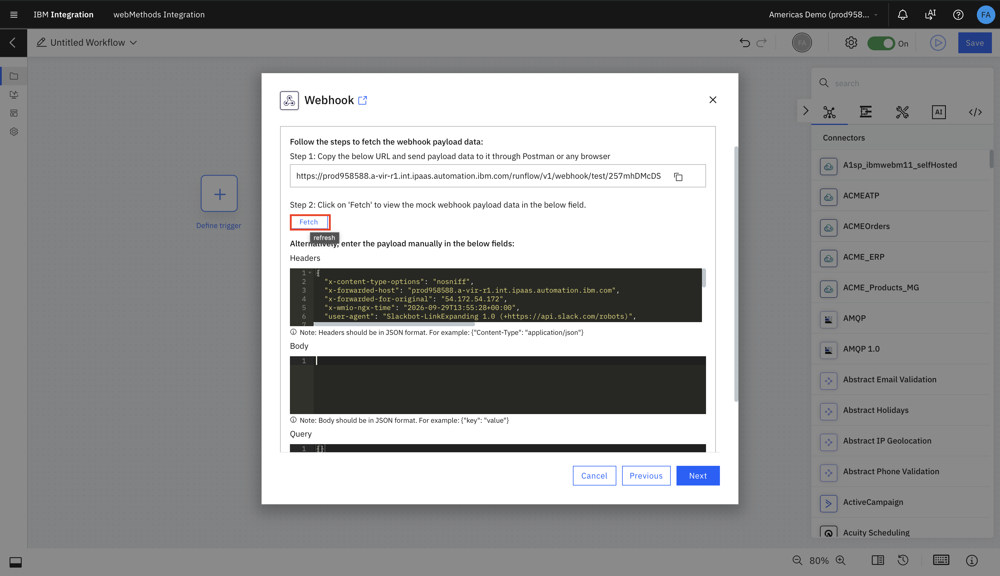

### URL final del Webhook

Al terminar el asistente verás la confirmación **"Webhook configured successfully!"** con la URL definitiva que deberás guardar. Haz clic en **Done**.

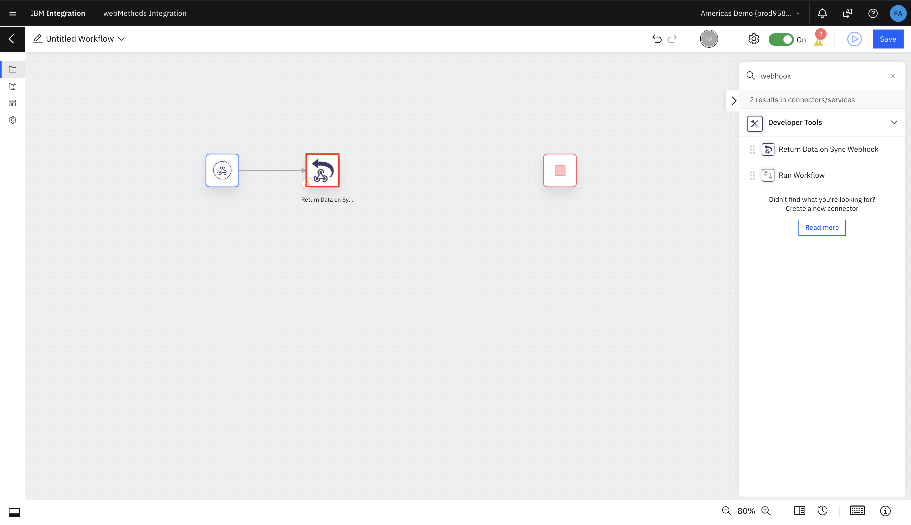

---

## Paso 2 — Return Data on Sync Webhook

Gracias a la opción **Autoconnect** del paso anterior, el bloque **Return Data on Sync Webhook** ya aparece conectado al Webhook en el canvas. Si necesitas añadirlo manualmente, búscalo como `webhook` en el panel derecho bajo **Developer Tools**.

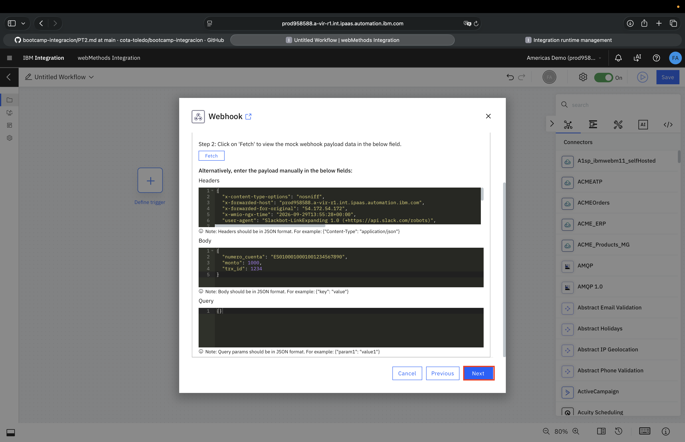

Al abrir la configuración del bloque, mantén el nombre por defecto **"Return Data on Sync Webhook"** y haz clic en **Next**.

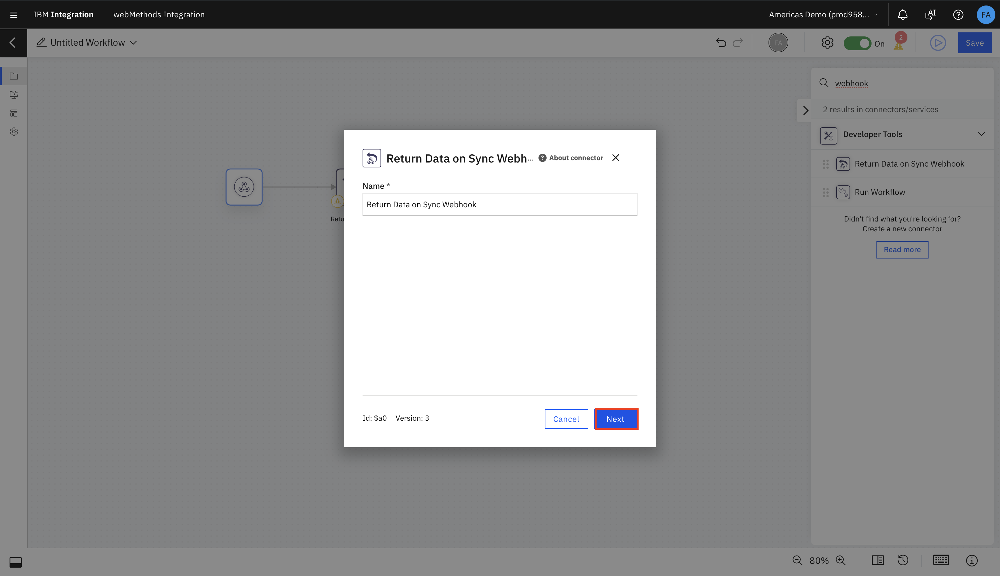

En la pantalla de mapeo verás los datos entrantes (`$request - Webhook`) en el panel izquierdo. Este bloque expone la data del request para que los bloques siguientes puedan consumirla. No necesitas mapear nada manualmente aquí — deja los valores por defecto y haz clic en **Next**.

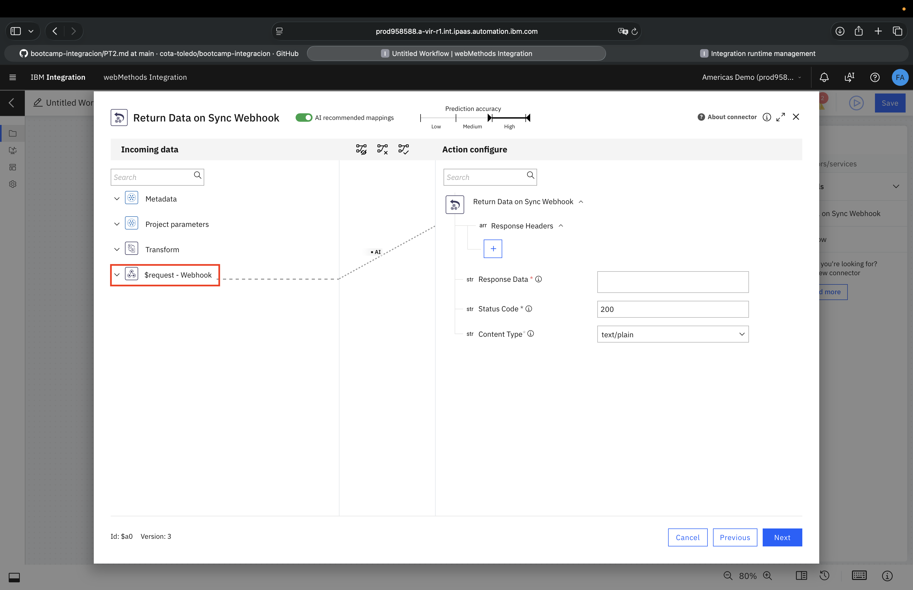

### Mapeo del Response Data

En el panel derecho (**Action configure**) encontrarás el campo **Response Data** aún vacío. Este campo define qué se le devolverá al caller como cuerpo de la respuesta HTTP sincrónica.

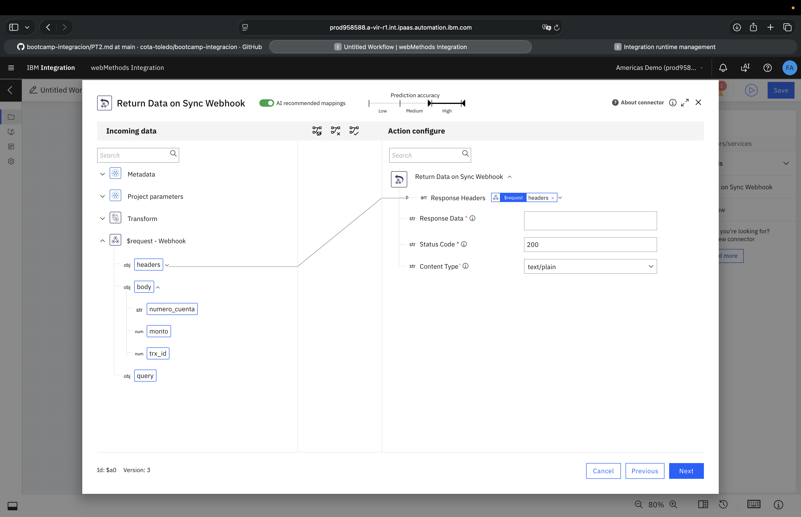

Arrastra el nodo **`body`** del panel izquierdo (dentro de `$request - Webhook`) hacia el campo **Response Data**. Verás que el campo queda marcado con la etiqueta `$request · body`, confirmando que la respuesta al webhook devolverá exactamente el body recibido.

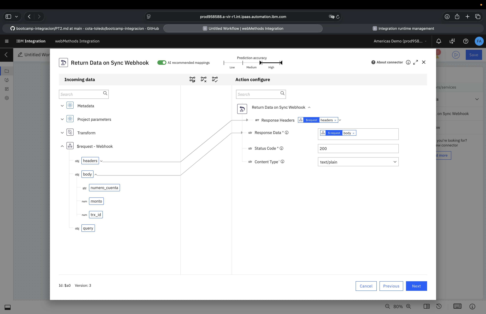

Haz clic en **Next**. IWHI ejecutará el bloque contra el payload de prueba y mostrará la pantalla **"Message posted successfully"** con el output real: verás el `data` con el JSON del body, el `__statuscode: 200` y el `content_type: text/plain`. Haz clic en **Done** para cerrar el asistente.

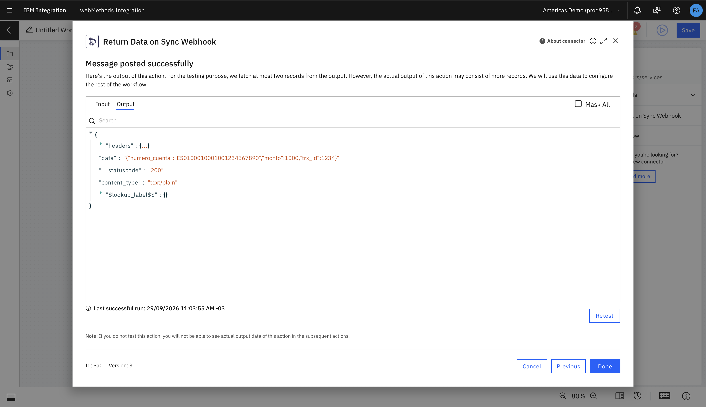

---

## Paso 3 — getClientInfo (FlowService)

Agrega el FlowService **`getClientInfo`** (creado previamente). Este bloque consulta la base de datos on-premise usando el `numero_cuenta` recibido en el webhook y retorna la información completa del cliente, incluyendo el saldo disponible en su cuenta.

### Buscar y arrastrar el bloque

En el panel derecho, escribe `getC` en el buscador. Aparecerá el FlowService **`getClientInfo`** del paquete `Bootcamp_beetechProject`. Haz clic en él para añadirlo al canvas como bloque pendiente de configurar (cuadrado rojo).

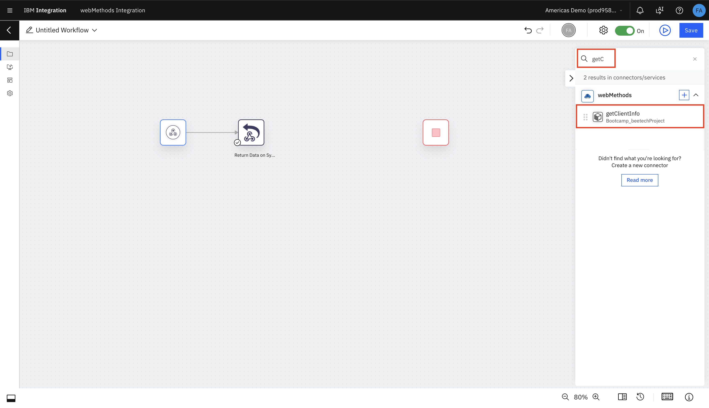

El bloque queda insertado en el canvas entre `Return Data on Sync Webhook` y el bloque de destino aún vacío. Nótese que ahora aparecen dos variantes: `getClientInfo` y `getClientInfo_` — selecciona **`getClientInfo_`** (la versión con guión bajo corresponde al FlowService conectado al runtime on-premise).

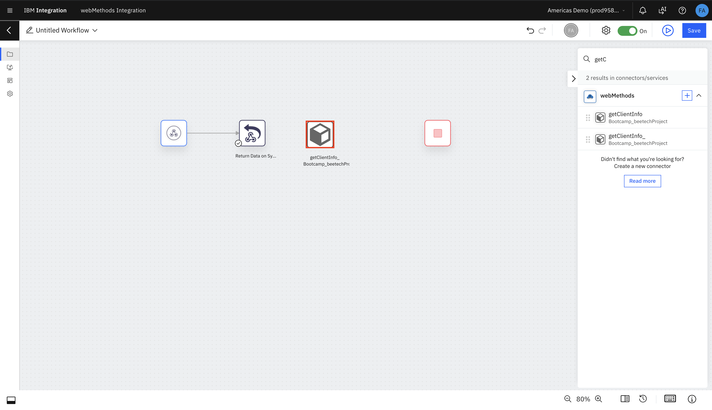

### Configurar el runtime

Se abrirá el modal de configuración. En el campo **Runtime**, despliega las opciones y selecciona **`runtime_beetech`** — el runtime on-premise que configuraste en la PT1 y que tiene acceso a la base de datos local.

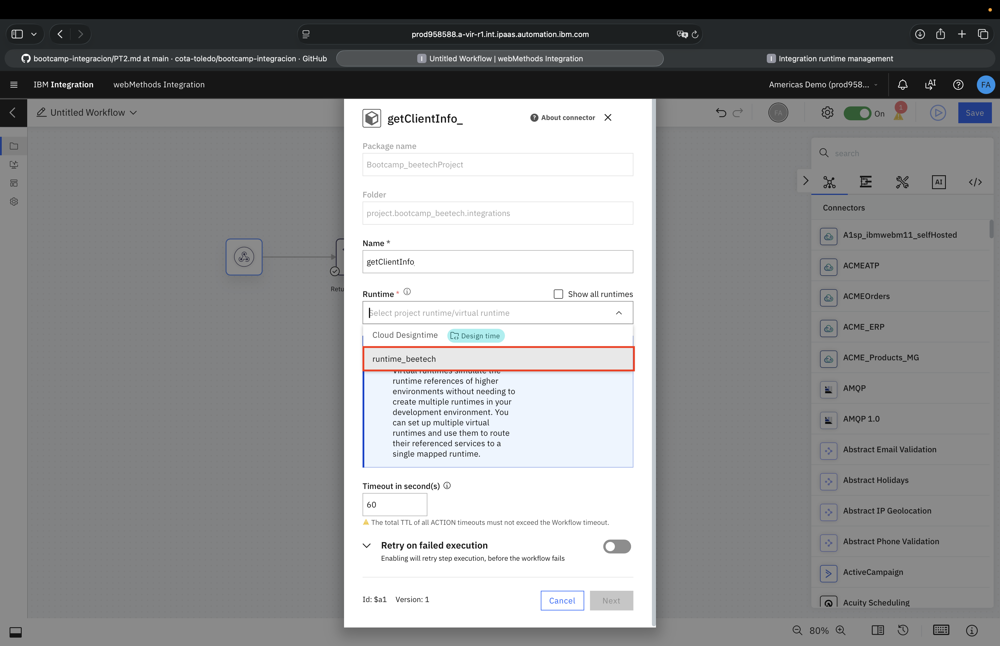

Opcionalmente puedes activar **Retry on failed execution** para que el bloque reintente automáticamente en caso de falla transitoria de conectividad. En el ejemplo se configuran **3 reintentos** con un intervalo de **2 minutos** entre cada uno (máximo de espera total: 6 minutos). Ajusta estos valores según tu tolerancia a latencia y haz clic en **Next**.

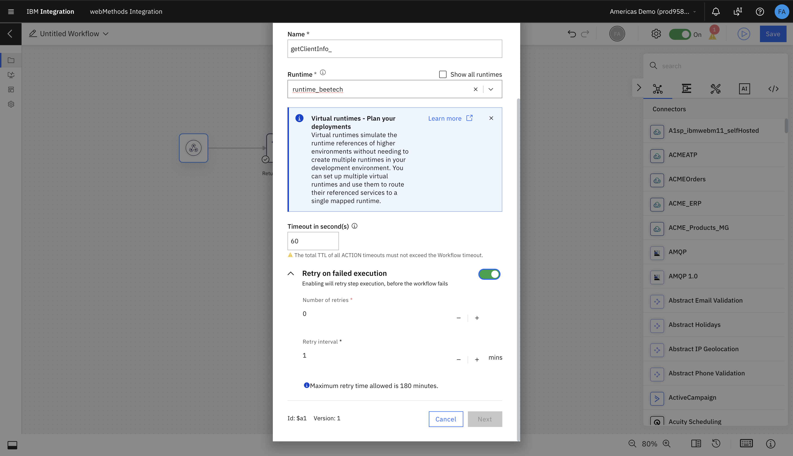

> **Nota:** La imagen siguiente muestra la misma pantalla de retry con los valores ya ajustados y el botón **Next** habilitado, listo para continuar.

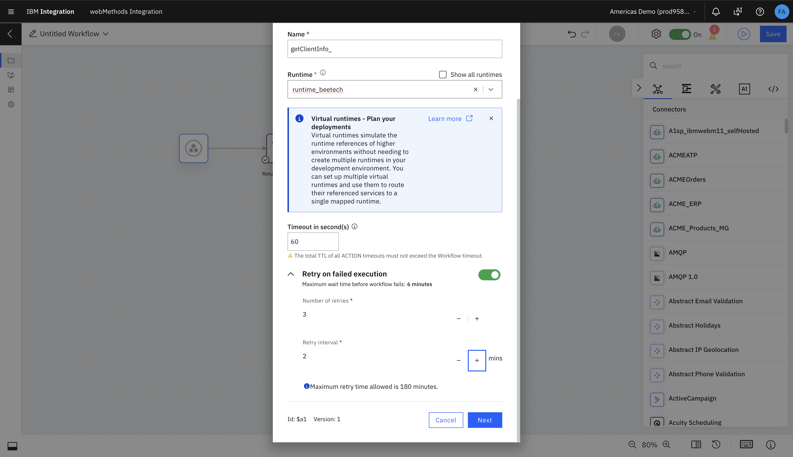

### Mapear el parámetro de entrada

En la pantalla de mapeo, el bloque `getClientInfo_` requiere el campo **`numero_cuenta`** como entrada. En el panel izquierdo, el ícono de IA (·AI·) indica que IWHI ha detectado automáticamente la fuente recomendada. Arrastra `$request - Webhook` → `body` → `numero_cuenta` al campo de la derecha, o acepta la sugerencia del asistente de IA.

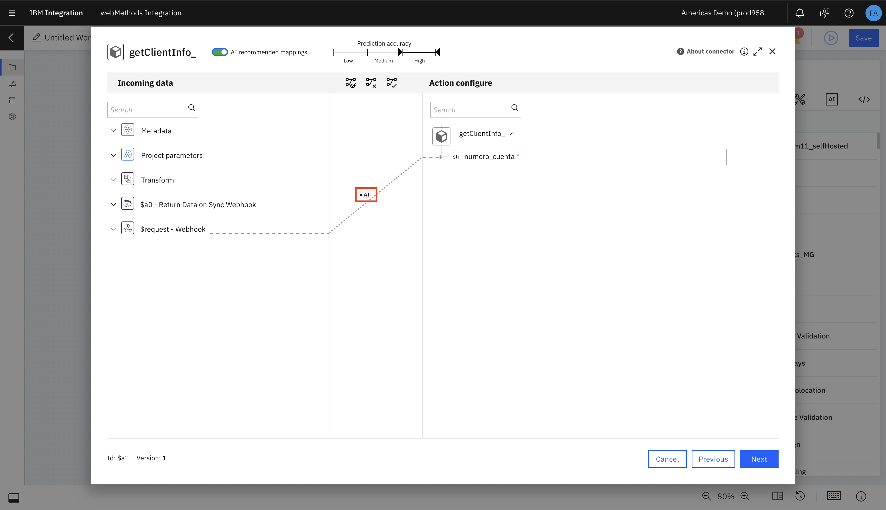

Haz clic en **Next**. IWHI invocará el FlowService contra el runtime `runtime_beetech` y mostrará **"Message posted successfully"** con el output real del servicio: verás los campos del cliente (`nombre_1`, `apellido_1`, `email_1`, `saldo_1`, etc.) y el `$status: "success"`. Haz clic en **Done**.

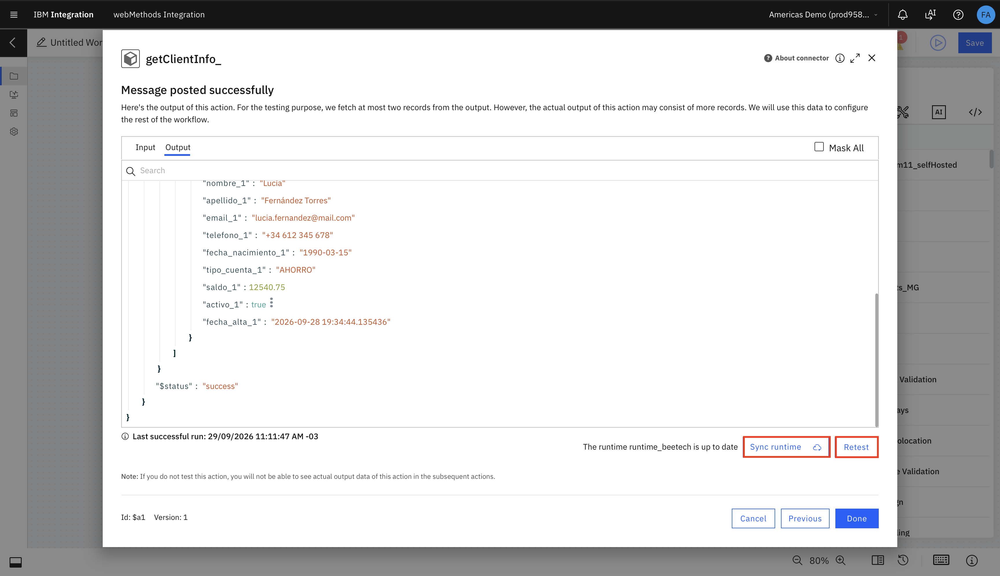

---

## Paso 4 — Switch (Evaluación de sobregiro)

En el buscador del panel derecho escribe `switch`. Aparecerá el bloque **Switch** bajo la categoría **Developer Tools**. Haz clic en él para añadirlo al canvas.

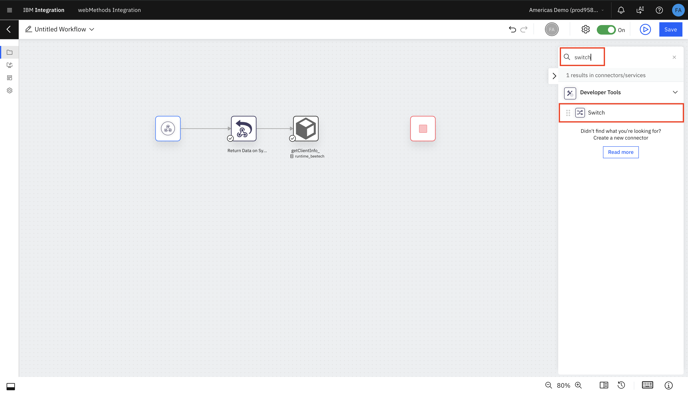

El bloque **Switch** queda insertado en el canvas a continuación de `getClientInfo_`. El canvas muestra ahora la cadena completa hasta este punto: Webhook → Return Data on Sync Webhook → getClientInfo_ → Switch.

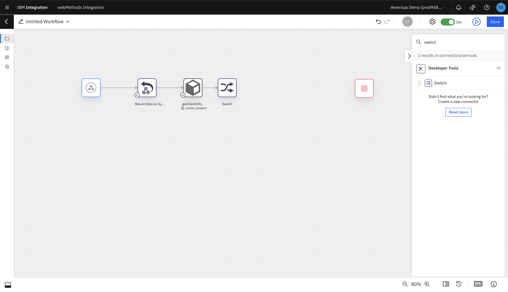

Agrega un bloque **Switch** que evalúa si la transacción debe ser aprobada o rechazada comparando el `monto` del webhook contra el `saldo` retornado por `getClientInfo`:

| Case | Condición | Resultado |
|---|---|---|
| `case 1` | `monto` ≤ `saldo` | ✅ Aprobado |
| `default` | `monto` > `saldo` | ❌ Rechazado — sobregiro |

---

## Paso 5 — Return (Respuesta al webhook)

Cada rama del Switch debe terminar con un bloque **Return** que devuelve el resultado de la evaluación como respuesta HTTP al caller. Esto permite que la web de pruebas muestre el resultado en tiempo real.

### 5.1 — Rama aprobada (`case 1`)

Configura el bloque Return con el siguiente JSON:

```json
{
  "resultado": "aprobado",
  "trx_id": "$trx_id",
  "numero_cuenta": "$numero_cuenta",
  "monto": "$monto",
  "nombre": "$nombre",
  "apellido": "$apellido",
  "saldo": "$saldo"
}
```

> Reemplaza cada `$campo` con el mapeo al valor correspondiente del contexto del workflow (el `trx_id` y `monto` vienen del webhook; `nombre`, `apellido` y `saldo` vienen del FlowService `getClientInfo`).

### 5.2 — Rama rechazada (`default`)

Configura el bloque Return con el siguiente JSON:

```json
{
  "resultado": "rechazado",
  "trx_id": "$trx_id",
  "numero_cuenta": "$numero_cuenta",
  "monto": "$monto",
  "nombre": "$nombre",
  "apellido": "$apellido",
  "saldo": "$saldo",
  "motivo": "Saldo insuficiente"
}
```

El campo `motivo` es texto fijo — no necesita mapeo dinámico.

---

## Paso 6 — Probar con el Transaction Tester

Con el workflow completo y activo en IWHI, levanta la web de pruebas para enviar transacciones reales y ver el resultado en vivo.

### 6.1 — Levantar el contenedor

La base de datos ya está corriendo desde la PT1. Solo hay que levantar el nuevo servicio desde la raíz del proyecto:

```bash
# Docker
docker compose up -d transaction-tester

# Podman
podman compose up -d transaction-tester
```

Abre **http://localhost:8080** en el navegador.

### 6.2 — Configurar la URL del webhook

1. Copia la URL del webhook que te entregó IWHI en el Paso 1.
2. Pégala en el campo **URL del workflow (IWHI)** de la web. Se guarda automáticamente en el navegador.

### 6.3 — Enviar transacciones de prueba

1. Haz clic en **Cargar cuentas** — la web consulta la base de datos y muestra las cuentas disponibles.
2. Selecciona una cuenta de la tabla.
3. Ingresa un **monto menor al saldo** de la cuenta → deberías ver ✅ **Transacción aprobada**.
4. Ingresa un **monto mayor al saldo** → deberías ver ❌ **Transacción rechazada**.

El registro al final de la página muestra el detalle completo de cada llamada (request enviado, HTTP status y respuesta raw de IWHI).
