# ⚙️ Lab 2 — Creación de Workflow en IWHI

En este laboratorio construiremos un **Workflow de orquestación en IBM webMethods Integration (IWHI)** para procesar solicitudes de transferencias bancarias. A través de un disparador HTTP (Webhook), el flujo recibirá las transacciones entrantes, consultará el saldo del cliente en la base de datos on-premise mediante el **FlowService** creado en el [Lab 1](lab1.md), evaluará las reglas de negocio con un bloque condicional (**Switch**) y devolverá una respuesta aprobando o rechazando la operación según los fondos disponibles.

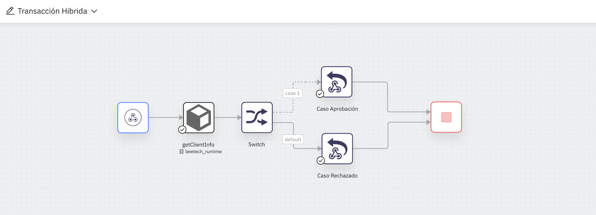

---

## Paso 1 — Crear el Workflow

Ve a la sección **Integrations → Workflows** dentro de tu proyecto en IBM webMethods Integration. Si aún no tienes ningún workflow, verás la pantalla vacía con el botón `+`.

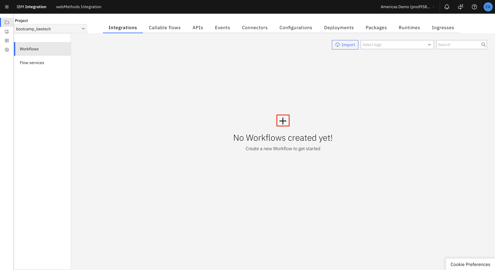

Haz clic en el botón `+` para iniciar la creación. Selecciona **Create New Workflow** para construirlo desde cero.

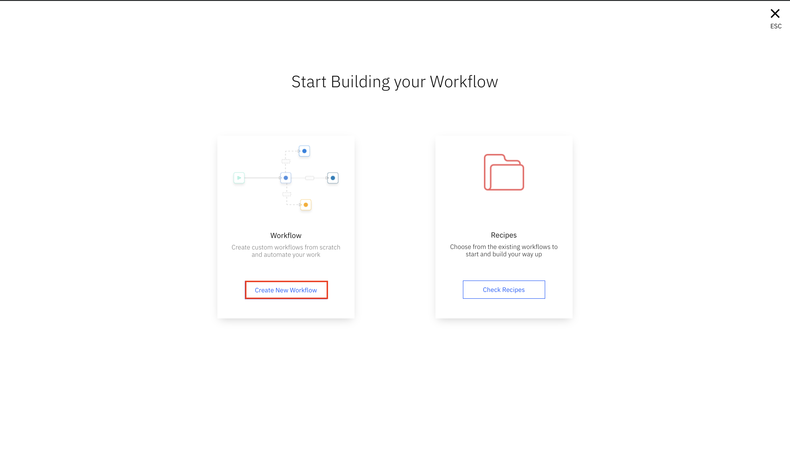

Se abrirá el **canvas** del workflow con el panel de conectores a la derecha. El flujo parte de un bloque vacío **Define trigger** que configuraremos a continuación.

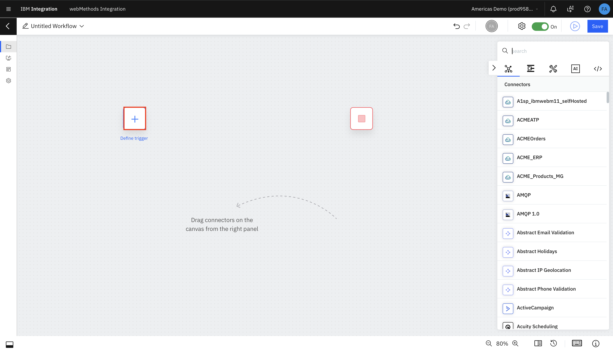

---

## Paso 1.1 — Configurar el Trigger Webhook

El primer bloque del workflow es un **Webhook** que actúa como punto de entrada (trigger): el flujo se gatillará cada vez que un cliente o aplicación externa solicite realizar una transacción.

Haz clic en el bloque **Define trigger** en el canvas. En el catálogo de triggers disponibles, selecciona **Webhook**.

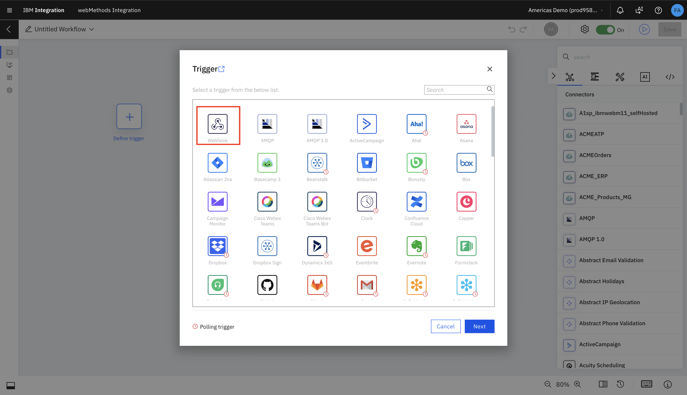

### Configuración del payload de muestra (Mock Data)

Para que webMethods Integration pueda inferir la estructura de datos que recibirá el flujo, se debe configurar un payload de prueba.

Puedes enviar el request de prueba a la URL temporal proporcionada haciendo clic en el ícono de copiar, o ingresar directamente la estructura JSON en el campo **Body**.

En este Hands-on vamos a utilizar ambos, tanto la utilización del flujo desde la UI para probar su comportamiento, como desde una web que se conecta indicando la URL. Copia la URL y guardala para los pasos siguientes. Finaliza este paso cargando el siguiente json en el campo **Body**: 

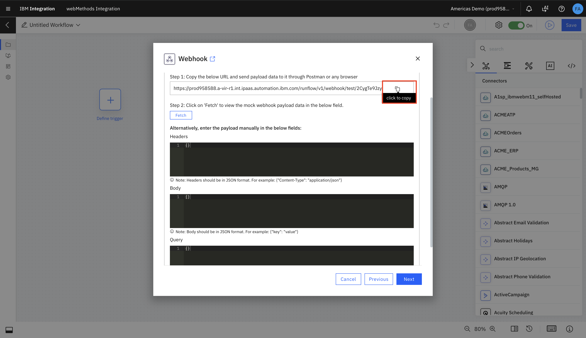

El body JSON esperado debe contener los campos `numero_cuenta`, `monto` y `trx_id`:

```json
{
  "numero_cuenta": "ES0100010001001234567890",
  "monto": 1000,
  "trx_id": 1234
}
```

| Campo | Tipo | Descripción |
|---|---|---|
| `numero_cuenta` | `string` | Número de cuenta del cliente emisor |
| `monto` | `number` | Monto monetario de la transacción |
| `trx_id` | `number` | Identificador único de la transacción |

Una vez ingresado, el body quedará validado. Haz clic en **Next**.

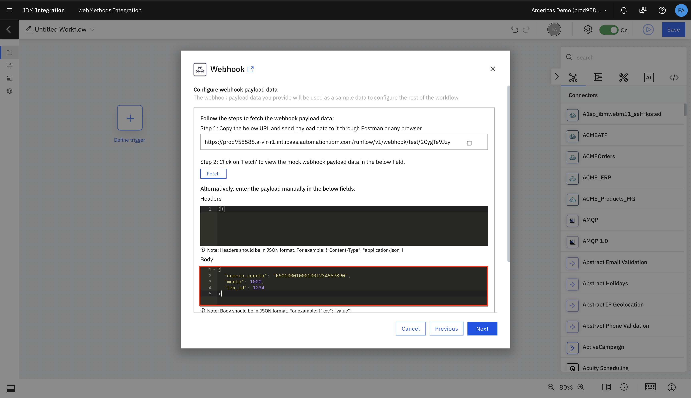

### Opciones del Webhook

En la pantalla de opciones de configuración:

- **Private webhook**: `Off`
- **Webhook Authentication**: `None`, Permitiendo facilitar la configuración en este ejemplo.
- **Autoconnect Return Sync on Webhook**: Déjalo en `Off`, luego agregamos dos bloque de Return Sync on Webhook explícitamente en cada rama de decisión.

Haz clic en **Next**.

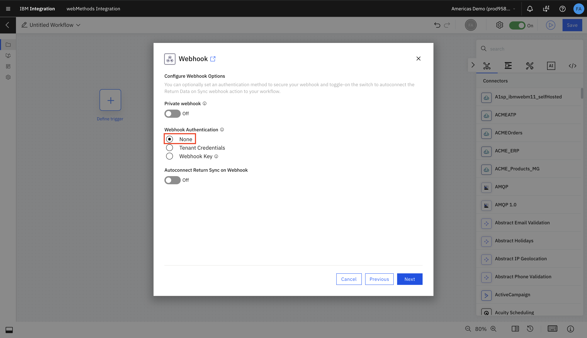

### Confirmación del Webhook

Aparecerá el mensaje **"Webhook configured successfully!"** junto con la URL final del webhook y el resumen del payload de prueba. Haz clic en **Done**.

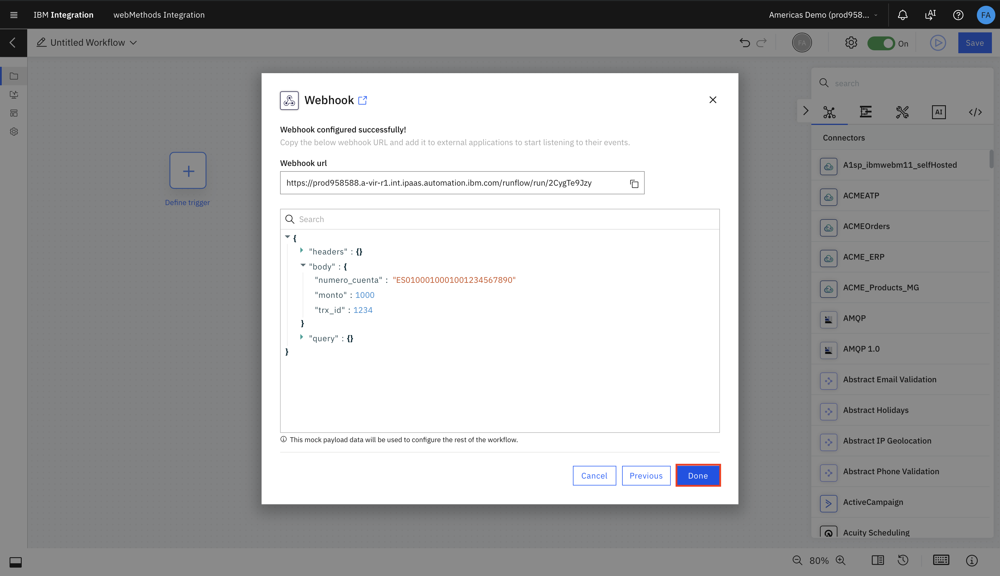

---

## Paso 2 — Agregar y Configurar el FlowService `getClientInfo`

A continuación, agregaremos el FlowService creado en el [Lab 1](lab1.md) para consultar en la base de datos on-premise los datos del cliente y su saldo actual.

### 2.1 — Buscar el conector FlowService

En el panel lateral derecho de conectores, escribe `getClientInfo` en la barra de búsqueda. Verás el conector **getClientInfo**.

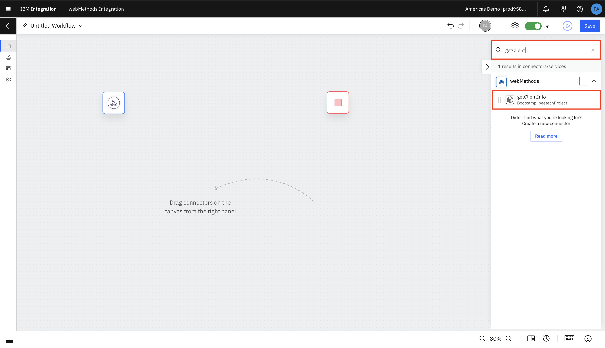

Arrastra el conector **getClientInfo** hacia el canvas justo después del bloque Webhook.

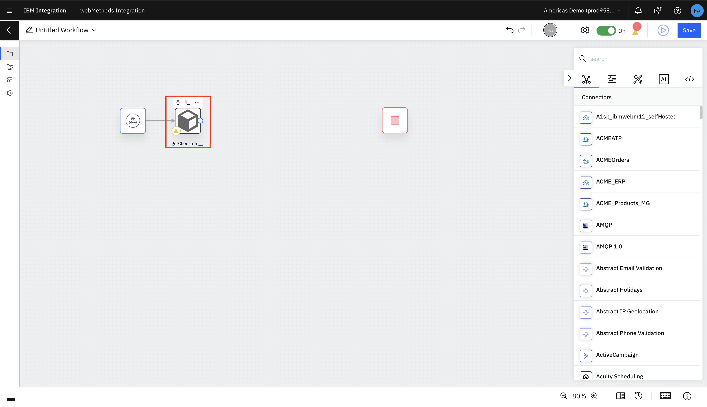

### 2.2 — Configurar el Runtime on-premise

En la ventana de configuración del bloque `getClientInfo`:

1. Despliega el selector **Runtime**.
2. Selecciona su runtime creado en la parte 1. En nuestro caso se llama **`beetech_runtime`** (el runtime que conecta con tu base de datos local on-premise).
3. Haz clic en **Next**.

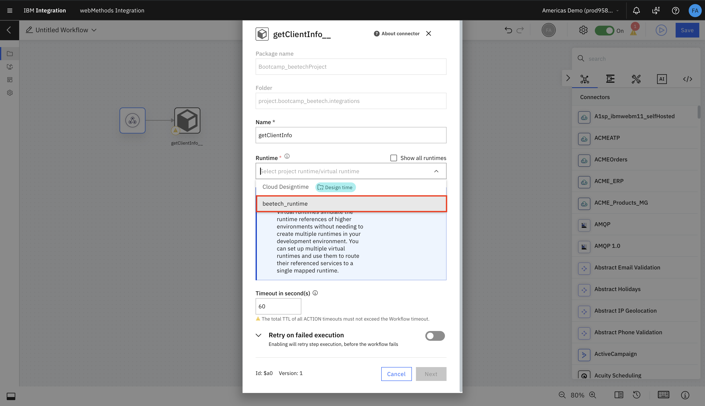

### 2.3 — Mapeo de parámetros de entrada

En la pantalla de configuración de datos de entrada (**Action configure**):

- Mapea el campo `numero_cuenta` proveniente de `$request` (Webhook `body`) hacia el parámetro `numero_de_cuenta` del getClientInfo.


> **Nota importante:** Para seleccionar un `Incoming Data`, tanto en este caso como en los proximos bloques, se recomienda seleccionar (hacer click) primero la casilla que quiero completar en `Active Configure`y luego selecionar la data (en este ejemplo `numero_de_cuenta` de `$request.body`) y se asignará automaticamente._

Haz clic en **Next**.

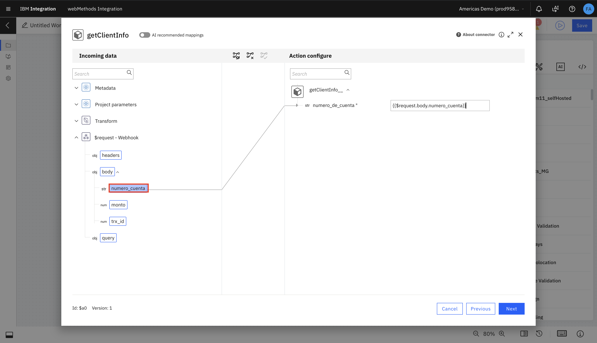

### 2.4 — Probar la ejecución de la acción

webMethods Integration solicitará ejecutar una prueba unitaria de la acción usando el payload de muestra para validar la conectividad con el runtime y recuperar el esquema de salida. 

Haz clic en **Test**. 

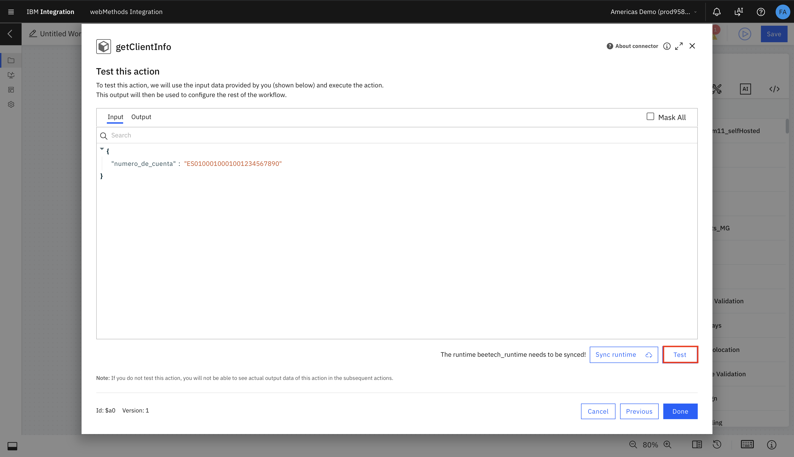

Verifica que la prueba retorne **"Message posted successfully"** y que los campos del cliente se reciban correctamente desde la base de datos. 

Haz clic en **Done**.

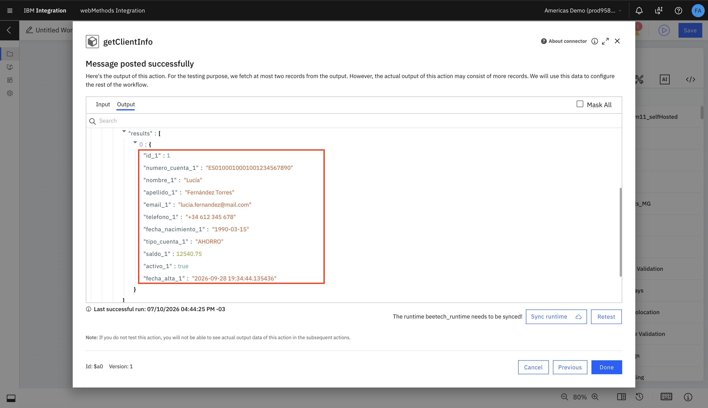

---

## Paso 3 — Agregar el Bloque de Decisión (Switch)

Para evaluar si el cliente cuenta con saldo suficiente para la transferencia, agregaremos una estructura condicional.

### 3.1 — Buscar el bloque Switch

En el panel lateral derecho, busca `switch`. En la sección **Developer Tools**, selecciona el conector **Switch**.

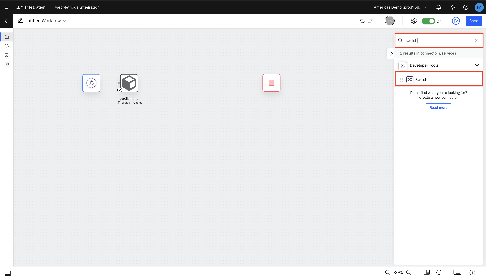

Arrastra el bloque **Switch** al canvas y conéctalo a la salida de `getClientInfo`.

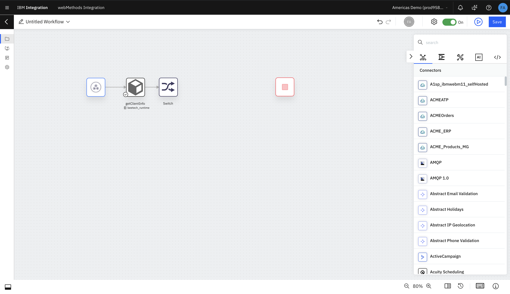

---

## Paso 4 — Agregar los Bloques de Respuesta (`Return Data on Sync Webhook`)

Dado que queremos recibir si la transacción fue aprobada o no, al utilizar un Webhook de triger, necesitamos devolver una respuesta HTTP al cliente según el resultado de la evaluación.

### 4.1 — Buscar Return Data on Sync Webhook

En el panel lateral derecho, busca el bloque por su nombre. Selecciona **Return Data on Sync Webhook** bajo **Developer Tools**.

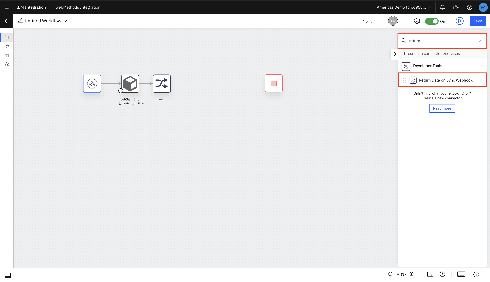

### 4.2 — Conectar el primer bloque de retorno (Rama 1)

Arrastra el primer bloque **Return Data on Sync Webhook** conectándolo a la primera rama del Switch.

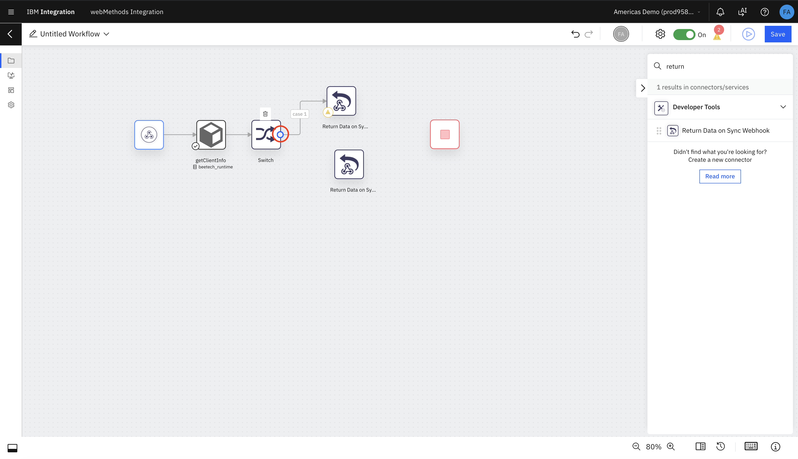

### 4.3 — Conectar el segundo bloque de retorno (Rama 2)

Arrastra un segundo bloque **Return Data on Sync Webhook** conectándolo a la segunda rama del Switch. Esta comenzará llamandose Case 2, pero en los pasos proximos (5.2) se definirá como el caso `Default`.

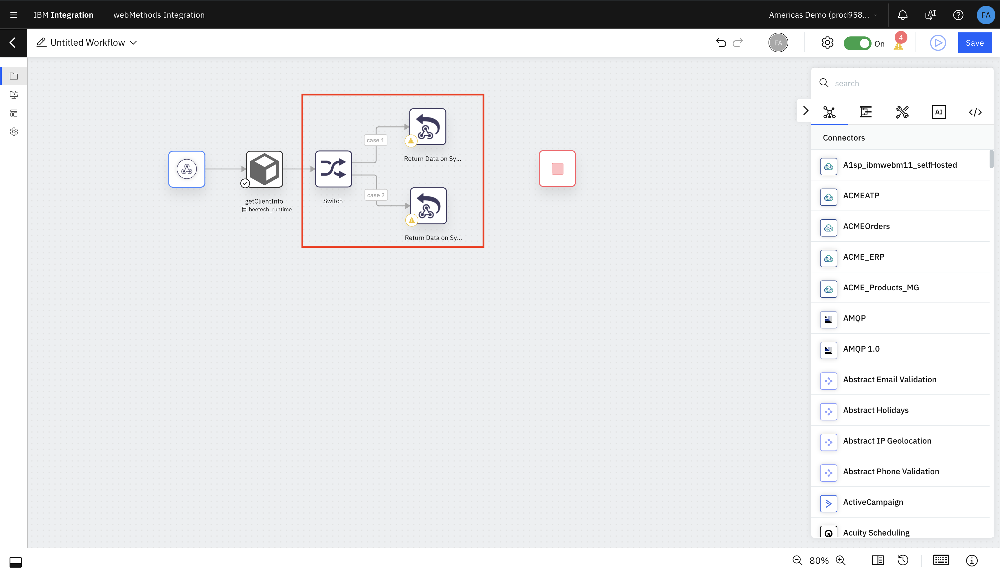

---

## Paso 5 — Configurar las Condiciones del Switch

Configuraremos las reglas lógicas que determinarán qué rama tomará el flujo:
- **Case 1 (Aprobado):** El monto de la transacción es menor o igual al saldo disponible (`monto <= saldo_1`).
- **Default (Rechazado):** El monto excede el saldo disponible.

### 5.1 — Configurar Case 1 (Condición de Aprobación)

Para configurar cada rama, haz click en la misma. Saldrán 4 iconos disponibles. Haz clic sobre el engranaje de configuración.

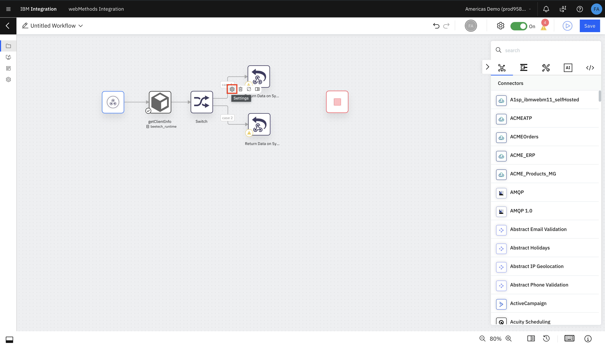

En el editor de condiciones:
1. En **Select Case**, asegúrate de estar en **Case 1**.
2. En **Condition Activity**, deberás seleccionar **Add Condition** y luego **Add Filter**. 
3. Por último en **Filter 1**:
   - En **Input**: selecciona el campo `$request -> body -> monto`.
   - En **Condition**: selecciona **(Number) Less Than Equals**.

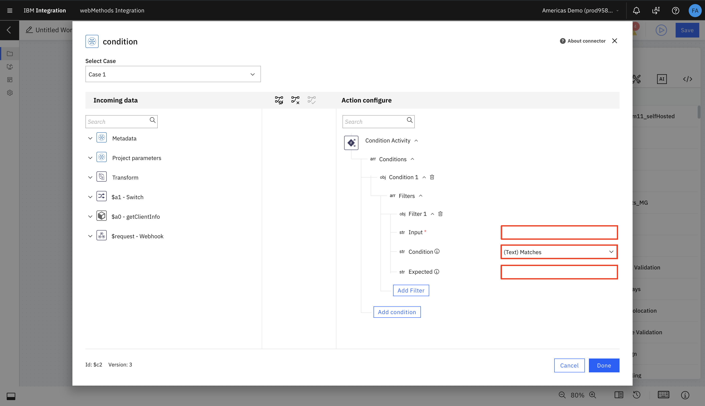
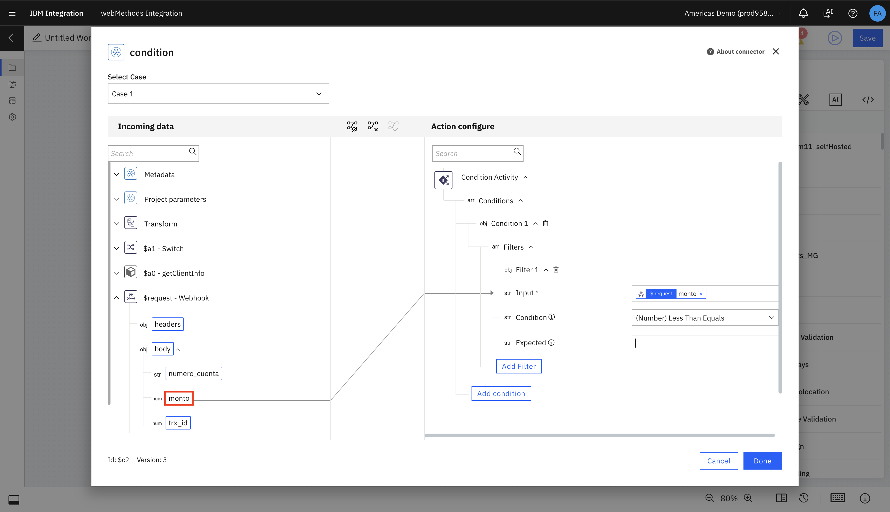

3. En **Expected**: selecciona el campo de saldo obtenido desde el FlowService `$a0 - getClientInfo -> results -> saldo_1`.
4. Haz clic en **Done**.

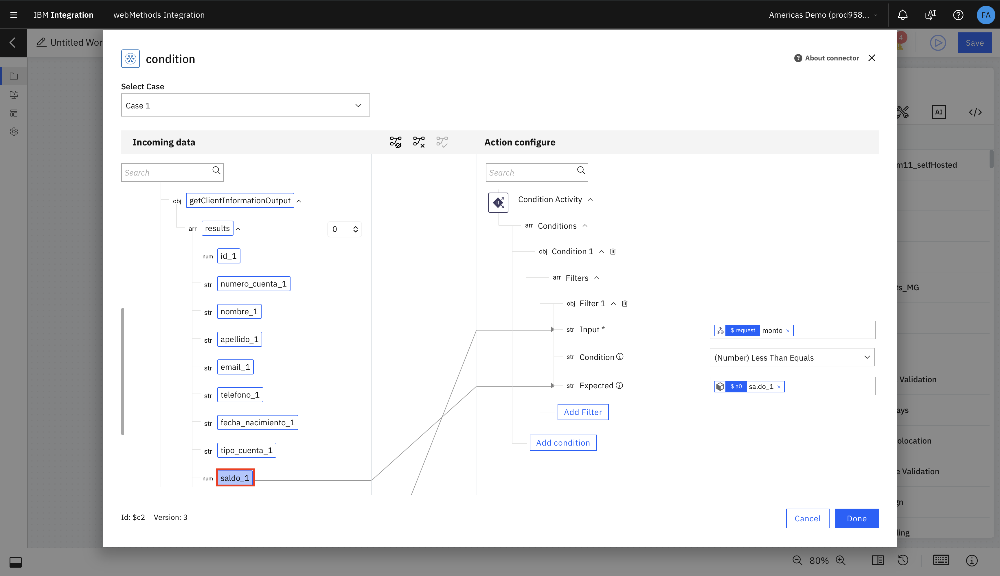

### 5.2 — Configurar Caso Default (Condición de Rechazo)

Haz clic en la configuración de la segunda rama del Switch.

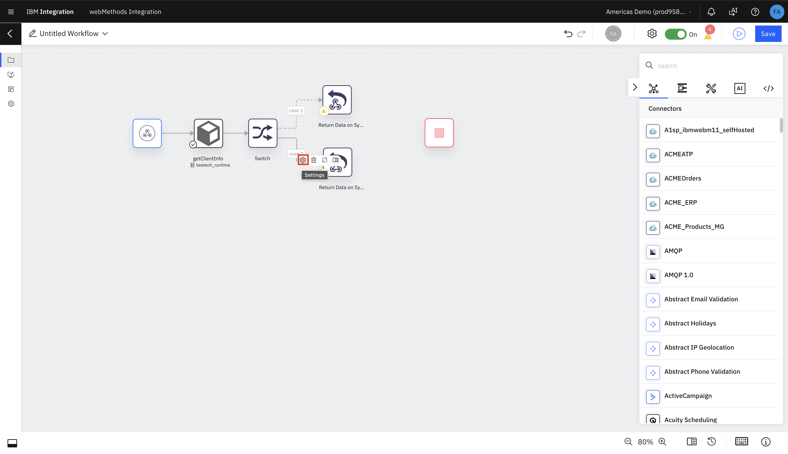

Selecciona **Case 2** y toma la opción **Default**. Al ser la condición complementaria (monto > saldo), no requiere filtros adicionales. 

Haz clic en **Done**.

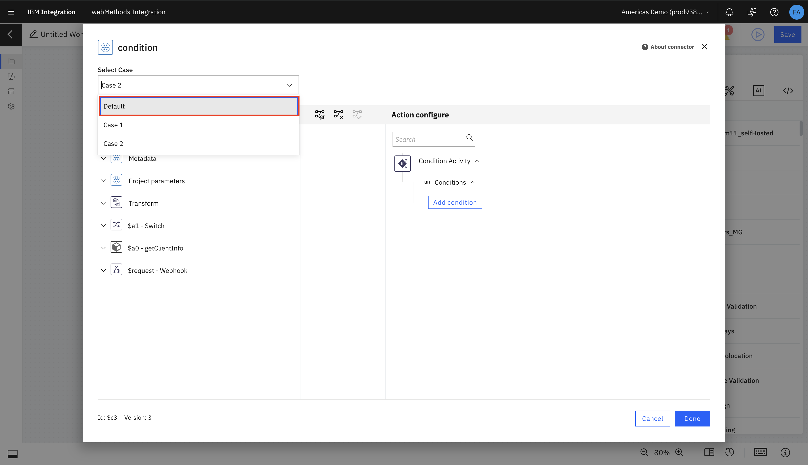

---

## Paso 6 — Configurar los Bloques de Respuesta

Configuraremos el payload JSON de salida para cada uno de los casos.

### 6.1 — Configurar "Caso Aprobación"

Abre el bloque de respuesta de la primera rama y renómbralo a **Caso Aprobación**.

En la pantalla de configuración:
- **Status Code**: `200`
- **Content Type**: `application/json`
- **Response Data**: Construye el JSON mapeando los datos dinámicos de la transacción y del cliente:

```json
{
  "resultado": "aprobado",
  "trx_id": {{$request.body.trx_id}},
  "numero_cuenta": "{{$request.body.numero_cuenta}}",
  "monto": {{$request.body.monto}},
  "nombre": "{{$a0.result.getClientInfoOutput.results[0].nombre_1}}",
  "apellido": "{{$a0.result.getClientInfoOutput.results[0].apellido_1}}",
  "saldo": {{$a0.result.getClientInfoOutput.results[0].saldo_1}}
}
```

Haz clic en **Next**.

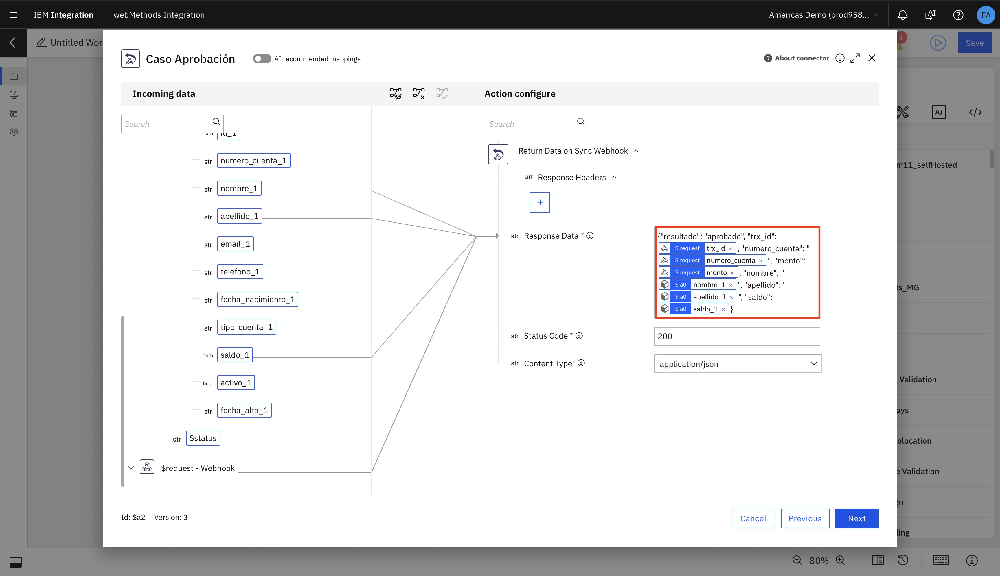

Ejecuta el test de la acción con **Test**.

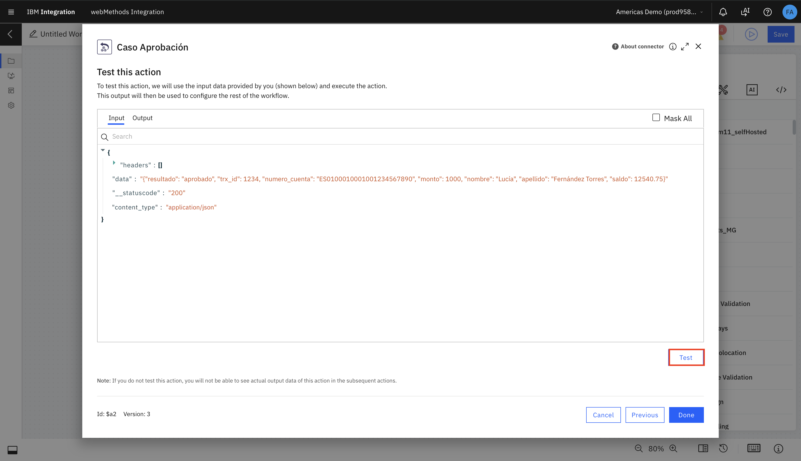

Verifica la respuesta exitosa con los datos del caso de prueba aprobado y haz clic en **Done**.

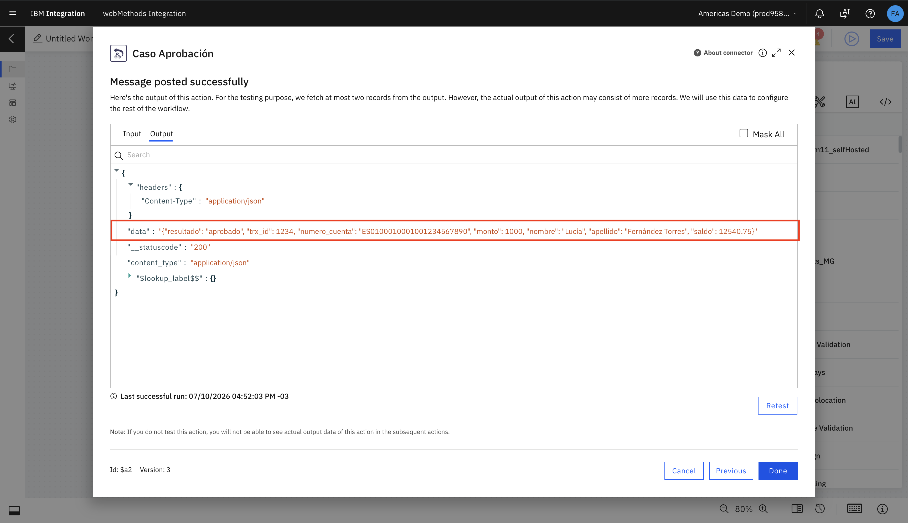

### 6.2 — Configurar "Caso Rechazado"

Abre el bloque de respuesta de la segunda rama y renómbralo a **Caso Rechazado**.

En la pantalla de configuración:
- **Status Code**: `200`
- **Content Type**: `application/json`
- **Response Data**: Construye el JSON incluyendo el campo `"motivo": "Saldo insuficiente"`:

```json
{
  "resultado": "rechazado",
  "trx_id": {{$request.body.trx_id}},
  "numero_cuenta": "{{$request.body.numero_cuenta}}",
  "monto": {{$request.body.monto}},
  "nombre": "{{$a0.result.getClientInfoOutput.results[0].nombre_1}}",
  "apellido": "{{$a0.result.getClientInfoOutput.results[0].apellido_1}}",
  "saldo": {{$a0.result.getClientInfoOutput.results[0].saldo_1}},
  "motivo": "Saldo insuficiente"
}
```

Haz clic en **Next**.

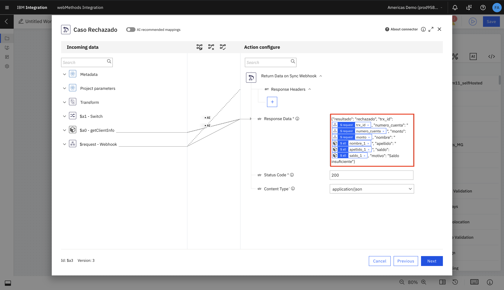

Ejecuta el test de la acción con **Test**.

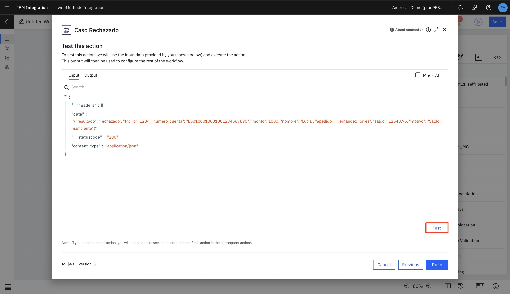

Verifica que el resultado muestre el payload de rechazo correctamente y haz clic en **Done**.

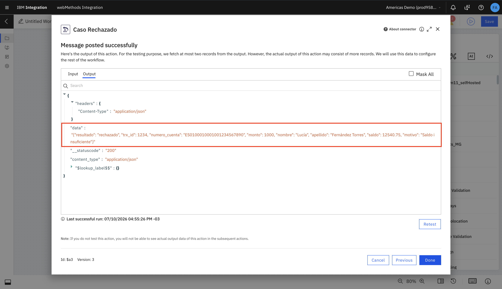

El canvas del workflow reflejará la configuración de casos y bloques completa. Solo faltando la conexión de los bloques de Return a el bloque final del workflow:


Una vez hecho esto, termina la configuración del workflow planteado.

---

## Paso 7 — Renombrar, Guardar y Activar el Workflow

1. Cambia el nombre del Workflow a **`Transacción Hibrida`** haciendo clic en el título superior.
2. Haz clic en **Save** para guardar los cambios.

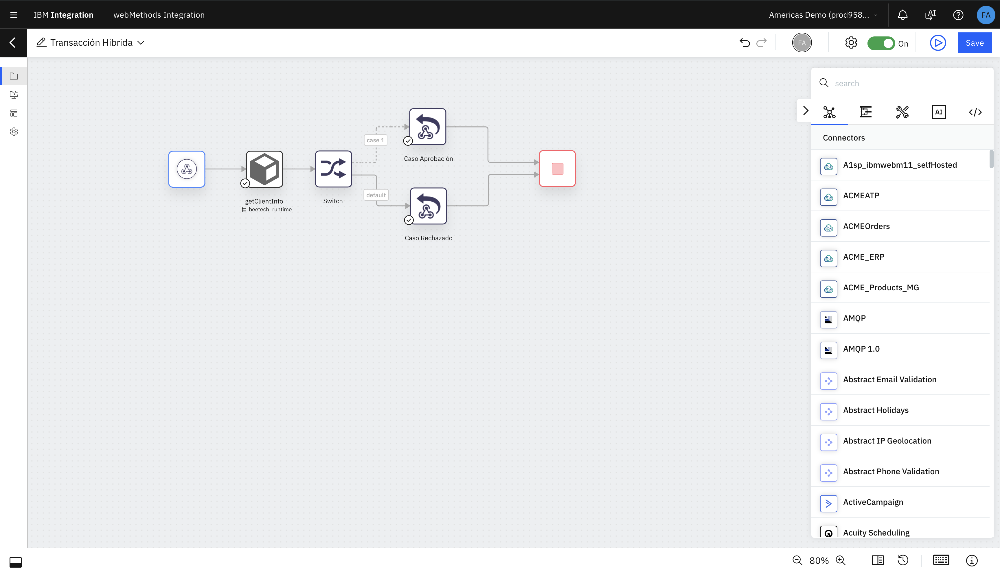

3. Testea el flujo completo, con los parametros que le asignamos inicialmente al trigger con el boton de **Run workflow**.

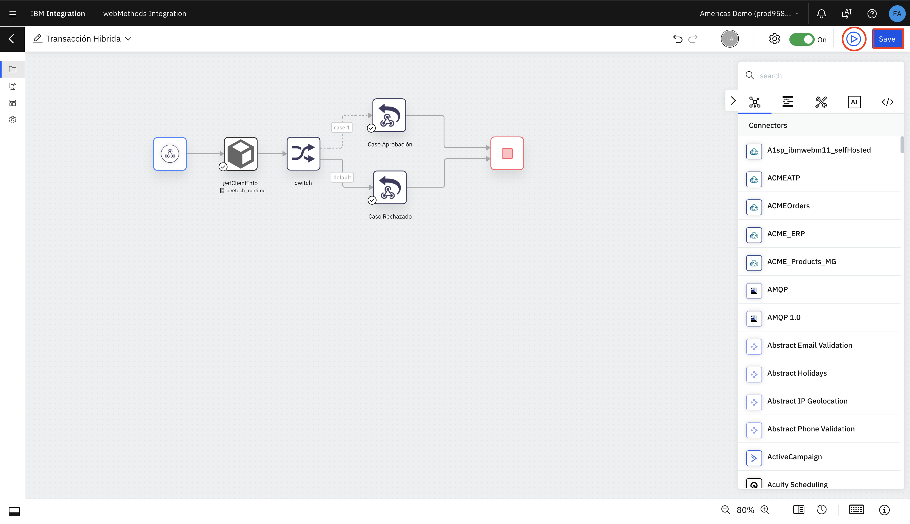

---

## Paso 8 — Pruebas End-to-End del Workflow en IWHI

Antes de conectar la aplicación externa, podemos validar ambos caminos directamente desde el canvas de webMethods Integration.

### 8.1 — Probar Caso Aprobado (Monto <= Saldo)

1. Con el payload de prueba inicial (`monto: 1000` <= `saldo: 12540.75`), ejecuta la prueba del workflow.
2. El flujo tomará la rama superior evaluando el giro y ejecutando **Caso Aprobado** satisfactoriamente:

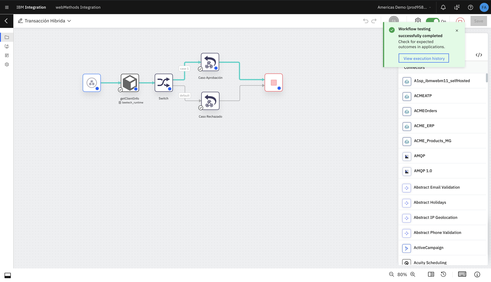

3. Verás la notificación verde **"Workflow testing successfully completed"**.

### 8.2 — Obtener la URL pública del Webhook

Abre la configuración del trigger Webhook:

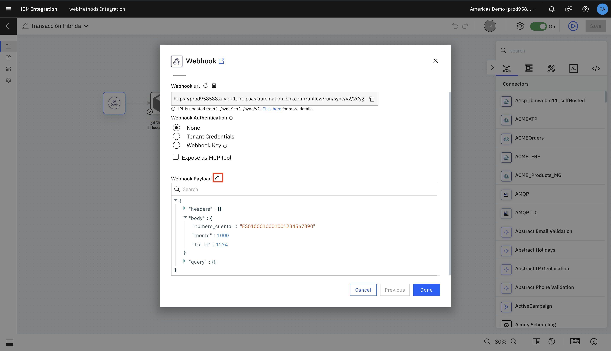

### 8.3 — Probar Caso Rechazado (Monto > Saldo)

1. En la configuración del Webhook, cambia el valor de prueba del campo `monto` a un valor superior al saldo, por ejemplo `15000`:

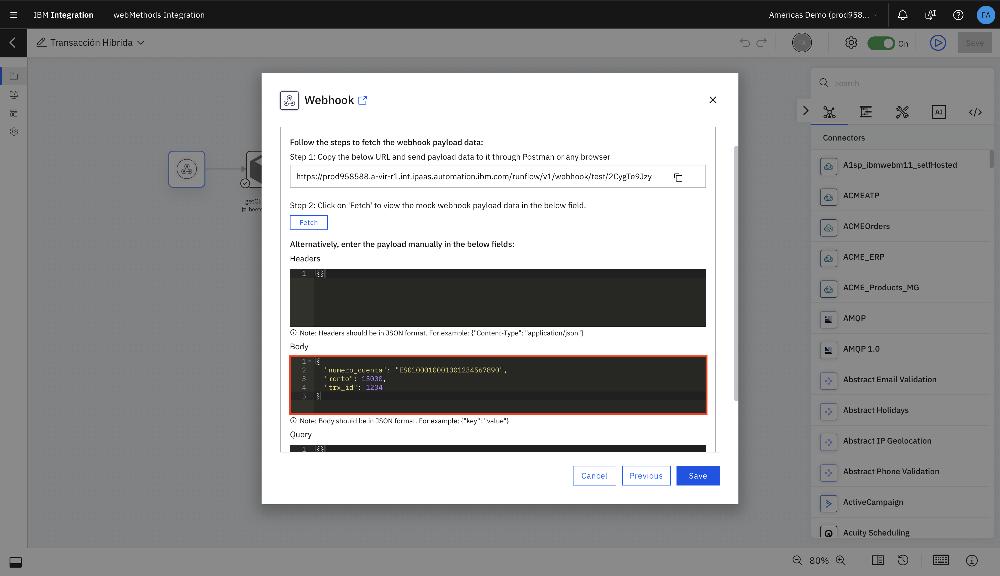

2. Haz clic en **Run workflow** para ejecutar la prueba en el canvas:

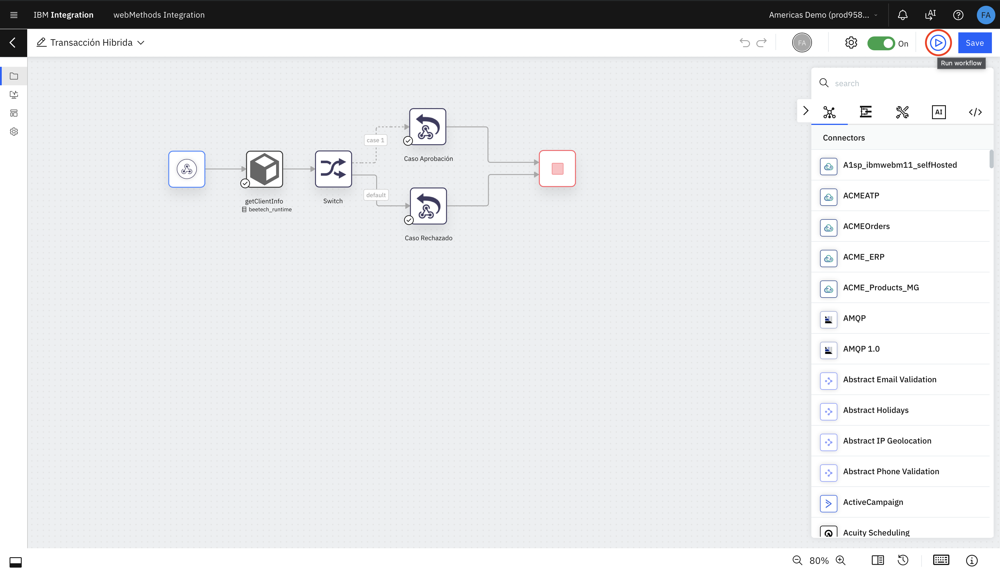

3. El flujo tomará la rama inferior evaluando el sobregiro y ejecutando **Caso Rechazado** satisfactoriamente:

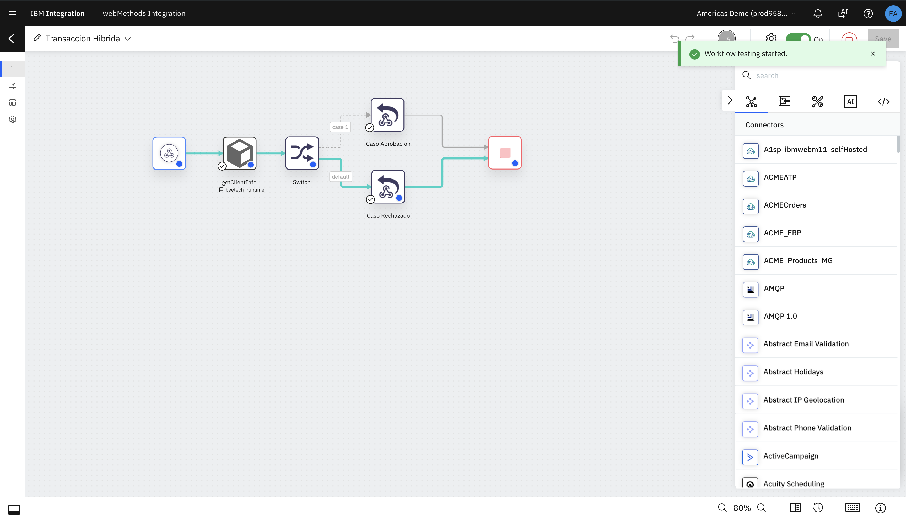

4. Verás la notificación verde **"Workflow testing successfully completed"**.

---

## Paso 9 — Probar con el Transaction Tester

Con el workflow completo, activo y validado en IWHI, utiliza la aplicación web **Transaction Tester** para simular transferencias interactivas.

### 9.1 — Levantar el contenedor

Asegúrate de tener corriendo la base de datos (iniciada en el [Lab 1](lab1.md)) y levanta el servicio de Transaction Tester desde la raíz del proyecto:

```bash
# Docker
docker compose up -d transaction-tester

# Podman
podman compose up -d transaction-tester
```

Abre **http://localhost:8080** en el navegador.

### 9.2 — Configurar la URL del webhook

1. Pega la URL del webhook copiada en el campo **URL del workflow (IWHI)**.
2. Haz clic en **Cargar cuentas** para recuperar la lista de clientes desde la base de datos.

### 9.3 — Ejecutar transacciones y validar resultados

1. Selecciona un cliente (por ejemplo, *Carlos Ramírez Vega* con saldo de $3,200).
2. **Prueba de Aprobación**: Ingresa un monto inferior a su saldo y haz clic en **Enviar transacción**. Se recibirá HTTP 200 con `"resultado": "aprobado"`.
3. **Prueba de Rechazo**: Ingresa un monto mayor a su saldo y haz clic en **Enviar transacción**. Se recibirá HTTP 200 con `"resultado": "rechazado"` y `"motivo": "Saldo insuficiente"`.

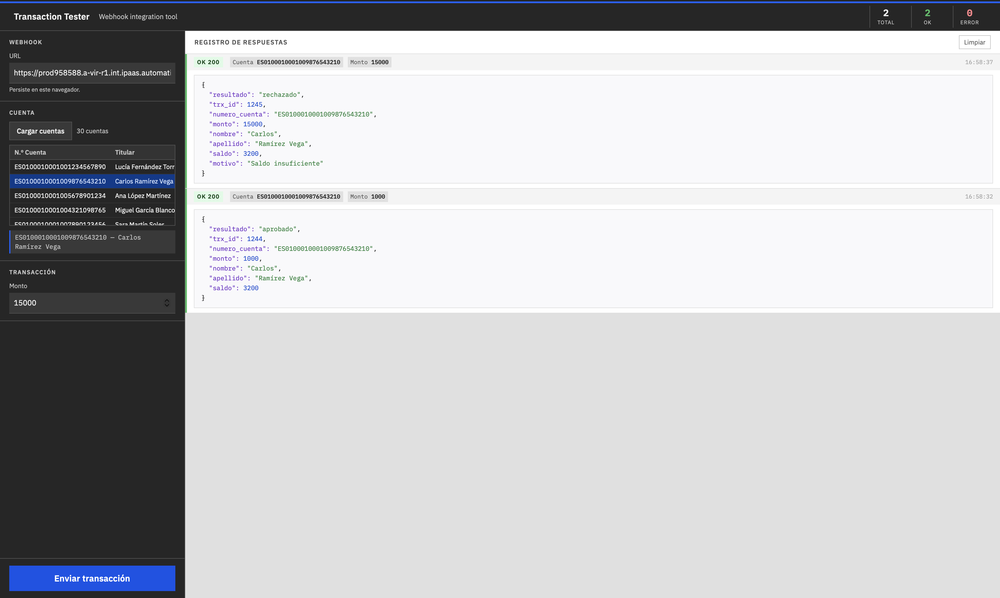

El panel **Registro de Respuestas** mostrará el historial en tiempo real con el código de estado, tiempos y payload JSON devuelto por webMethods Integration.
